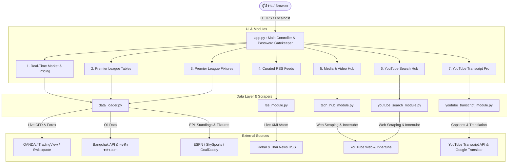

# ⚡ NewsL • Real-Time Intelligence Matrix

> **ระบบศูนย์ข้อมูลและสารสนเทศเรียลไทม์รอบโลก (100% Free • Zero-API-Key Edition)**
> แพลตฟอร์มสารสนเทศอัจฉริยะที่รวบรวมข้อมูลการเงิน, ราคาทองคำ, น้ำมันขายปลีกไทย, ดัชนีตลาดโลก, ตารางคะแนนและผลบอลพรีเมียร์ลีก, คลังข่าวสาร RSS ทั่วโลก, มีเดียฮับ, ระบบค้นหา YouTube และระบบถอดสคริปต์วิดีโอพร้อมแปลภาษาไทยอัตโนมัติ

---

## 📑 สารบัญ (Table of Contents)
1. [ภาพรวมสถาปัตยกรรมระบบ (System Architecture)](#-ภาพรวมสถาปัตยกรรมระบบ-system-architecture)
2. [สถาปัตยกรรมระดับโมดูล (Module Breakdown)](#-สถาปัตยกรรมระดับโมดูล-module-breakdown)
   - [1. Entry Point & Security Gatekeeper (`app.py`)](#1-entry-point--security-gatekeeper-apppy)
   - [2. Real-Time Data Loader & Financial Feeds (`data_loader.py`)](#2-real-time-data-loader--financial-feeds-data_loaderpy)
   - [3. Curated RSS Live Feeds (`rss_module.py`)](#3-curated-rss-live-feeds-rss_modulepy)
   - [4. Media & Video Hub (`tech_hub_module.py`)](#4-media--video-hub-tech_hub_modulepy)
   - [5. YouTube Search Hub (`youtube_search_module.py`)](#5-youtube-search-hub-youtube_search_modulepy)
   - [6. YouTube Transcript Pro (`youtube_transcript_module.py`)](#6-youtube-transcript-pro-youtube_transcript_modulepy)
   - [7. Configuration & Styling System (`config.py`)](#7-configuration--styling-system-configpy)
3. [วิธีการติดตั้งและรันโปรเจกต์ (Installation & Running)](#-วิธีการติดตั้งและรันโปรเจกต์-installation--running)
   - [รันบนเครื่อง Local](#การรันบนเครื่อง-local-development)
   - [การ Deploy บน Streamlit Cloud](#การ-deploy-บน-streamlit-cloud-production)
4. [มาตรฐานการพัฒนาตาม `.cursorrules` และ `AGENTS.md`](#-มาตรฐานการพัฒนาตาม-cursorrules-และ-agentsmd)

---

## 🏛️ ภาพรวมสถาปัตยกรรมระบบ (System Architecture)

NewsL ถูกออกแบบภายใต้หลักการ **Zero-API-Key Architecture** และ **Defensive Component Isolation**:
- **ไม่ต้องพึ่งพา Paid API Keys**: ข้อมูลทั้งหมดดึงจาก Direct Stream, Interbank Feeds, Public Scrapers, RSS Feeds, และ Innertube Endpoints
- **Fault-Tolerant & Component Isolation**: หากแหล่งข้อมูลภายนอกแหล่งใดแหล่งหนึ่งล่มหรือติดขัด จะมีระบบ Fallback รองรับทันที และแสดง Warning เฉพาะจุด โดยไม่ทำให้ Streamlit App แครชทั้งหน้า
- **High-Performance Caching**: ทุกฟังก์ชันที่มีการเชื่อมต่อเครือข่ายจะถูกครอบด้วย `@st.cache_data(ttl=...)` เพื่อลดภาระการยิง Request ซ้ำซ้อนและเพิ่มความเร็วในการตอบสนอง



---

## 🧩 สถาปัตยกรรมระดับโมดูล (Module Breakdown)

### 1. Entry Point & Security Gatekeeper (`app.py`)
- **ความรับผิดชอบหลัก**: เป็นจุดเริ่มต้นของแอปพลิเคชัน จัดการ Navigation Sidebar, Dynamic Font Size Scaling (Compact / Normal / Large) และควบคุมระบบความปลอดภัย
- **Private Password Gatekeeper**: ตรวจสอบรหัสผ่านผ่าน `st.secrets["APP_PASSWORD"]` ก่อนอนุญาตให้เข้าถึงเนื้อหา Dashboard
- **Defensive Rendering**: ครอบ `try-except` ในการเรียกใช้งานทุกหน้า เพื่อป้องกัน unhandled traceback หลุดไปยังหน้าจอผู้ใช้

### 2. Real-Time Data Loader & Financial Feeds (`data_loader.py`)
- **ราคาทองคำแท่งไทย 96.5% & Gold Spot (XAU/USD)**:
  - สกัดราคาทองคำแท่งไทยจาก `สมาคมค้าทองคำ / ทองคำราคา.com`
  - สกัด Gold Spot เรียลไทม์ตรงจาก 3 แหล่งชั้นนำ: OANDA CFD, FXStreet, และ Swissquote Bank
  - ดึงค่าเงินบาท (USD/THB) จาก OANDA Real-time scanner และสำรองด้วย Frankfurter Interbank API
- **ราคาน้ำมันขายปลีกในประเทศไทย**:
  - เชื่อมต่อ API ของบางจากอย่างเป็นทางการ (`ApiOilPrice2`) เพื่ออ่านราคาปัจจุบันและราคาประกาศปรับล่วงหน้าพรุ่งนี้
  - สกัดตารางเปรียบเทียบราคา 8 ปั๊มหลัก และสร้าง Step Chart ราคาน้ำมันย้อนหลังรายวันต่อเนื่อง (Daily Continuous Time Series)
- **Macro Drivers & Mega Tech / AI Stocks**:
  - ดึง Dollar Index (DXY), US 10Y Yield, WTI Crude Oil, Nasdaq 100, S&P 500
  - ดึงราคาหุ้นเทคโนโลยี & AI ชั้นนำ (NVDA, MSFT, AAPL, GOOGL, AMZN, META, TSM, AVGO, TSLA)
- **Premier League Standings & Fixtures**:
  - ดึงตารางคะแนนสด 20 สโมสรจาก ESPN & Sky Sports
  - ดึงผลบอลสดและเวลาเตะตรงเวลาไทย (UTC+7) จาก GoalDaddy Live API พร้อมชุดข้อมูลสำรองสมบูรณ์

### 3. Curated RSS Live Feeds (`rss_module.py`)
- **ช่องสัญญาณข่าว 6 หมวดหมู่หลัก**:
  1. `🤖 AI & Deep Tech`: OpenAI, Google DeepMind, Anthropic Claude, Meta AI, Hugging Face, Qwen, Kimi, DeepSeek, Zhipu AI
  2. `🚀 Science & Global Tech`: NASA, TechCrunch, The Verge, Ars Technica
  3. `📈 Finance & Markets`: Financial Times, Investing.com Gold & Commodities, CNBC
  4. `🌍 World News & Geopolitics`: Al Jazeera, BBC World, Google News World, Middle East Geopolitics
  5. `🇹🇭 ข่าวไทย & กระแสเด่น`: ไทยรัฐออนไลน์, THE STANDARD, PPTV HD 36
  6. `⚽ Sports & Football`: This Is Anfield, Premier League Official, BBC Sport
- **ฟังก์ชันสำคัญ**:
  - `@st.cache_data(ttl=300)` เพื่อแคชข้อมูล 5 นาที
  - ระบบค้นหาหัวข้อข่าวแบบเรียลไทม์ (Keyword Filtering)
  - การทำความสะอาดข้อความและตัด HTML Tag ออกอย่างสมบูรณ์

### 4. Media & Video Hub (`tech_hub_module.py`)
- **3 แท็บการใช้งาน**:
  1. `🌐 เว็บไซต์ข่าว`: สแกนหัวข้อข่าวสดจากเว็บไอทีชั้นนำ (TNN Tech, Beartai, DroidSans, Techhub, Blognone, TechCrunch, The Verge) พร้อมระบบ Fallback RSS
  2. `📋 YouTube Playlists`: ดึงคลิปวิดีโอจาก Playlist ได้สูงสุด 300 คลิป พร้อมระบบจัดเรียง (Newest First, Original Order, Oldest First)
  3. `🎥 YouTube Channels`: ดึงคลิปจากช่อง YouTube แยกตามหมวดหมู่ (IT & Tech, Anime & Movies, Sports, ธรรมบรรยายวัดป่าโสมพนัส)
- **ฟังก์ชันสำคัญ**:
  - Innertube Continuation Token Pagination สำหรับดึงคลิปจำนวนมาก
  - Recency Scoring คำนวณความสดใหม่ของคลิป

### 5. YouTube Search Hub (`youtube_search_module.py`)
- **การค้นหาแบบ Zero-API-Key**: ดึงผลลัพธ์การค้นหาวิดีโอบน YouTube โดยตรง พร้อม Pagination (10 - 300 คลิป)
- **การจัดเรียง**: รองรับการเรียงตามวันอัปโหลดล่าสุด (Upload Date - Newest First), Relevance, View Count, Rating
- **Theater Mode Player**: โรงภาพยนตร์ส่วนตัวในหน้าจอ พร้อมระบบบันทึกรายการโปรด (Favorites) และประวัติการค้นหา (History)

### 6. YouTube Transcript Pro (`youtube_transcript_module.py`)
- **การดึงสคริปต์คำบรรยาย**: สกัด Captions/Transcripts จาก YouTube ผ่าน `youtube-transcript-api`
- **Smart Paragraph Merging**: รวมท่อนเสียงสั้นๆ ตามจังหวะหยุดพูด (Speech Pause Gap) ให้อ่านง่าย
- **Auto-Translate to Thai**: แปลงสคริปต์ภาษาต่างประเทศเป็นภาษาไทยอัตโนมัติด้วย Multi-threaded Translation
- **Export 4 รูปแบบพร้อม UTF-8 BOM**:
  1. `📄 Clean Text (.txt)`: ข้อความต่อเนื่องล้วน
  2. `⏱️ Timestamps (.md)`: ข้อความ Markdown พร้อมระบุช่วงเวลา
  3. `🎬 Subtitles (.srt)`: ไฟล์คำบรรยายมาตรฐาน
  4. `🤖 AI/LLM Prompt (.txt)`: โครงร่างคำสั่งพร้อมส่งให้ ChatGPT / Claude / Gemini สรุปเนื้อหา

### 7. Configuration & Styling System (`config.py`)
- **Responsive CSS Design System**: ดีไซน์ Typography ทันสมัย (Google Fonts: Plus Jakarta Sans & Prompt)
- **Auto Dark Mode Support**: รองรับทั้ง Light และ Dark Mode อัตโนมัติตามธีมของระบบ
- **Club Badges Vector Registry**: ระบบจับคู่ตราสโมสรพรีเมียร์ลีกมาตรฐานความละเอียดสูง

---

## 🚀 วิธีการติดตั้งและรันโปรเจกต์ (Installation & Running)

### 1. การเตรียมสภาพแวดล้อม (Prerequisites)
- Python 3.10 ขึ้นไป
- ติดตั้ง Dependencies ผ่าน `requirements.txt`:
```bash
pip install -r requirements.txt
```

### 2. การตั้งค่า Secrets (`.streamlit/secrets.toml`)
สร้างไฟล์ `.streamlit/secrets.toml` เพื่อกำหนดรหัสผ่านเข้าใช้งาน:
```toml
APP_PASSWORD = "your_secure_password"
```

---

### 💻 การรันบนเครื่อง Local (Development)
> ⚠️ **กฎสำคัญ**: ตาม `AGENTS.md` ให้รันบน Local พอร์ต `8502` เสมอ

```bash
streamlit run app.py --server.port 8502
```
👉 เปิดเบราว์เซอร์ที่: [http://localhost:8502](http://localhost:8502)

---

### ☁️ การ Deploy บน Streamlit Cloud (Production)
- **URL ระบบจริง**: 👉 [https://newslite.streamlit.app](https://newslite.streamlit.app)
- **ข้อควรระวังสำคัญ**:
  - **ห้ามฮาร์ดโค้ด `port` ใน `.streamlit/config.toml` โดยเด็ดขาด** มิเช่นนั้นจะทำให้ Streamlit Cloud เชื่อมต่อไม่ติด (Healthcheck failed / "Oh no. Error running app.")
  - ตั้งค่า `APP_PASSWORD` ในส่วน **Secrets Management** บน Streamlit Cloud Console

---

## 📋 มาตรฐานการพัฒนาตาม `.cursorrules` และ `AGENTS.md`

| ข้อกำหนด | มาตรฐานที่นำมาปฏิบัติในโปรเจกต์ |
|---|---|
| **Zero-Tolerance for Placeholders** | โค้ดทุกโมดูลถูกเขียนตัวเต็ม 100% ไม่มี `# TODO`, `# Implement later` หรือ `pass` จำลอง |
| **Defensive Scraping & Error Handling** | ครอบ `try-except` ทุกจุดที่มี network call พร้อมกำหนด `timeout` ชัดเจน และมีระบบ Fallback ไม่ทำให้ Streamlit App แครช |
| **Streamlit Caching Strategy** | ทุกฟังก์ชันดึงข้อมูลครอบด้วย `@st.cache_data(ttl=...)` ป้องกันการยิง request ซ้ำซ้อน |
| **Thai Encoding & Localization** | ทุกจุดที่มีการ Export/Save หรือประมวลผลภาษาไทย ใช้ UTF-8 BOM (`\ufeff` หรือ `utf-8-sig`) และทำ `unicodedata.normalize('NFC', text)` |
| **No Auto GitHub Push** | พัฒนาและทดสอบบน Local ให้เสร็จสมบูรณ์ก่อนเสมอ จะ push ขึ้น GitHub ต่อเมื่อได้รับคำสั่งเท่านั้น |
| **Port Compatibility Guard** | ไม่ฮาร์ดโค้ดพอร์ตใน `config.toml` เพื่อความเข้ากันได้ 100% กับ Streamlit Cloud |

---

*พัฒนาและดูแลด้วยความพิถีพิถันเพื่อการใช้งานสารสนเทศระดับมืออาชีพ*
